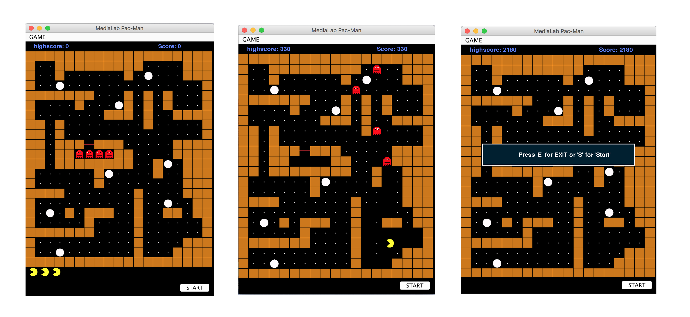

# Pacman [](https://github.com/CodePeters/Pacman/blob/master/LICENSE)

**Pacman Game implementation in Java**
______________________________________

## Compililation:

```
javac Pacman.java Gui.java filereader.java Board.java
```

## Execution:

```
java Pacman
```



**File Game-boards contains three game-boards but you could add new as well just make sure to include them in Pacman.java file**

**by adding lines:**

```
GameBoards.add(new filereader("./game-boards/Myboard.txt").get()); 
```

supposing Myboard.txt is the new game board that you added.

**File gifs contains all the icons if pacman and ghoasts used in the game.**

## _License_

This project is licensed under the GPLv3 License - see the [LICENSE](LICENSE) file for details